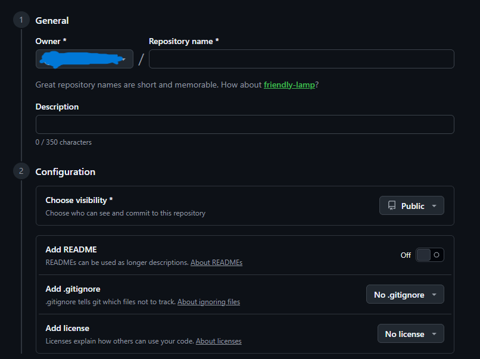

# git-demo

Some Content Added!

This Repo is all about learning Git Version Control!

## Generating pair of SSH Key

This key is used to securely authincate your machine to your github account

1. "ssh-keygen -t rsa –C "[your email address]"

> Reminder This command will generate 2 files, you must open one file ending with .pub extension. after that copy everything there and go in your account Settings -> SSH and GPG keys -> New SSH key -> Enter Name in first fild and paste your copied key in second field -> Add SSH Key. That's it!

2. For Credententials

   git config --global user.name “[Your Name]“

   git config --global user.email “[Your Email]"

## Creating GitHub Repository (+Cloning)

If you want to create github repository you need to go to "github.com" then go in your profile -> repositories -> and top right corner green button "new"

1. First field is name of repository
2. Second field is Description
3. Visibility gives us option to choose whether we want your repository to be public or private
4. This radiobutton is we want our repository to have readme file or not
5. This radiobutton gives us option to add .gitignore file which tells Git which files or folders to skip and not track in your project
6. This dropdown is used to add license, which determines how can others use your code

### Cloning git repository

To achive that , there is 3 different ways to clone repository

1. Using HTTPS protocol `git clone https://github.com/[your username]/[your repository].git`
2. Using SSH protocol `git clone git@github.com:[your username]/[your repository].git`
3. Using Github CLI `gh repo clone [your username]/[your repository]`

> Reminder: Only difference between SSH and HTTPS is that how they authenticate who you are HTTPS uses : Personal Access Token (PAT) or GitHub login credentials. while SSH uses : pair of cryptographic keys (Public & Private) stored on your machine.
